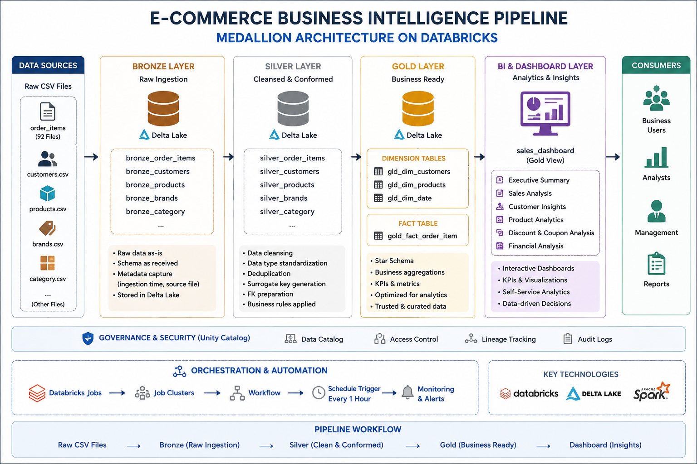
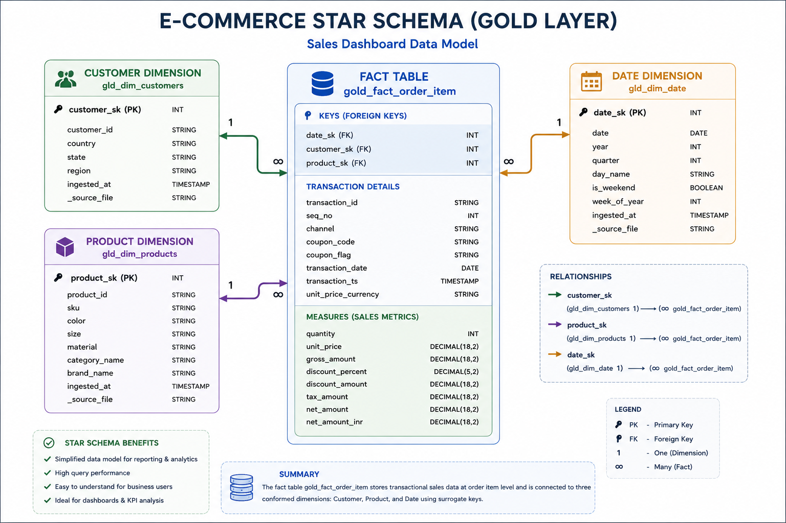

# 🚀 E-Commerce Business Intelligence Pipeline using Databricks Medallion Architecture

<p align="center">
  
</p>

<p align="center">
  
  
  
  
  
</p>

---

# 📌 Project Overview

This project is a complete **End-to-End E-Commerce Business Intelligence Pipeline** built on **Databricks** using the **Medallion Architecture (Bronze → Silver → Gold)**.

The pipeline ingests raw CSV datasets, performs large-scale data cleansing and transformations using **PySpark**, builds a **Star Schema Data Warehouse**, and powers a fully interactive **Business Intelligence Dashboard**.

The project demonstrates real-world:

* Data Engineering workflows
* ETL pipeline orchestration
* Delta Lake implementation
* Star schema modeling
* Automated Databricks Jobs
* Dashboard analytics
* Medallion Architecture best practices

---

# 🏗️ Medallion Architecture

The project follows a layered data engineering architecture:

## 🥉 Bronze Layer

* Raw CSV ingestion
* Schema preservation
* Metadata tracking
* Initial Delta conversion

## 🥈 Silver Layer

* Data cleansing
* Standardization
* Null handling
* Deduplication
* Datatype transformation
* Surrogate key generation

## 🥇 Gold Layer

* Business-ready dimensions
* Fact table creation
* KPI calculations
* Star schema modeling
* Dashboard datasets

---

# 📊 Architecture Diagrams

## 🔹 Medallion Architecture

<p align="center">
  
</p>

### Explanation

This diagram represents the complete Medallion architecture workflow implemented in Databricks.

The pipeline begins with raw CSV ingestion from source datasets and progressively transforms the data through:

* Bronze Layer → Raw Delta ingestion
* Silver Layer → Cleansed and standardized datasets
* Gold Layer → Star schema warehouse
* BI Dashboard → Executive analytics layer

The architecture also integrates:

* Unity Catalog
* Delta Lake
* Databricks Workflows
* Scheduled Jobs
* Automated hourly triggers

---

## 🔹 Star Schema Architecture

<p align="center">
  
</p>

### Explanation

The Gold Layer follows a professional **Star Schema** design.

### Fact Table

* `gold_fact_order_item`

### Dimension Tables

* `gld_dim_products`
* `gld_dim_customers`
* `gld_dim_date`

The joins are implemented using:

* `product_sk`
* `customer_sk`
* `date_sk`

This enables:

* Fast analytical queries
* Dashboard optimization
* Scalable warehouse design
* Enterprise BI reporting

---

## 🔹 Workflow Pipeline

<p align="center">
  
</p>

### Explanation

The workflow pipeline automates the entire ETL process using Databricks Jobs.

### Execution Flow

```text
Setup Catalog
    ↓
Dimension Bronze
    ↓
Dimension Silver
    ↓
Dimension Gold
    ↓
Fact Bronze
    ↓
Fact Silver
    ↓
Fact Gold
    ↓
Sales Dashboard
```

### Features

* Scheduled execution every 1 hour
* Automated notebook orchestration
* End-to-end ETL automation
* Scalable workflow design
* Enterprise pipeline structure

---

# ⚙️ Tech Stack

| Technology           | Purpose                     |
| -------------------- | --------------------------- |
| Databricks           | Cloud Data Platform         |
| PySpark              | Distributed Data Processing |
| Delta Lake           | Storage Layer               |
| Unity Catalog        | Data Governance             |
| SQL                  | Analytics & Transformations |
| Databricks Workflows | Pipeline Automation         |
| Databricks Dashboard | BI Visualization            |
| Python               | ETL Development             |

---

# 📂 Project Structure

```text
Ecommerce-BI-Pipeline/
│
├── README.md
├── architecture/
│   ├── medallion_architecture.png
│   ├── dashboard_architecture.png
│   └── workflow.png
│
├── datasets/
│   └── sample_data/
│       ├── brands.csv
│       ├── category.csv
│       └── sample_order_items.csv
│
├── notebooks/
│   ├── 1_setup/
│   │   └── setup_catalog.sql
│   │
│   ├── 2_dimension_pipeline/
│   │   ├── 1_dim_bronze.py
│   │   ├── 2_dim_silver.py
│   │   └── 3_dim_gold.py
│   │
│   ├── 3_fact_pipeline/
│   │   ├── 1_fact_bronze.py
│   │   ├── 2_fact_silver.py
│   │   └── 3_fact_gold.py
│   │
│   └── 4_dashboard/
│       └── sales_dashboard_query.sql
│
├── dashboard_screenshots/
│   ├── executive_summary.png
│   ├── sales_analysis.png
│   ├── customer_insights.png
│   ├── product_analytics.png
│   ├── discount_coupon_analysis.png
│   └── financial_analysis.png
│
├── jobs/
│   └── databricks_job_config.json
│
└── docs/
    ├── project_workflow.md
    ├── star_schema.md
    └── pipeline_explanation.md
```

---

# 📈 Dashboard Pages

The BI dashboard contains multiple business-focused analytics pages.

---

## 📌 Executive Summary

<p align="center">
  
</p>

### Features

* Total Sales KPI
* Total Orders
* Customer Metrics
* Sales Trends
* Channel Analysis
* Product Performance

---

## 📌 Sales Analysis

<p align="center">
  
</p>

### Features

* Daily Sales Trends
* Revenue Growth
* Sales Heatmaps
* Brand & Category Analytics
* Time-Based Sales Analysis

---

## 📌 Customer Insights

<p align="center">
  
</p>

### Features

* Geographic Sales Analysis
* Customer Segmentation
* State-Level Analytics
* Order Distribution
* Customer Ranking

---

## 📌 Product Analytics

<p align="center">
  
</p>

### Features

* Product Performance
* Material Analysis
* Color Distribution
* Price vs Quantity Analysis
* Top Selling Products

---

## 📌 Discount & Coupon Analytics

<p align="center">
  
</p>

### Features

* Coupon Usage Analytics
* Discount Trends
* Channel-wise Discounts
* Category Discount Breakdown
* Revenue Impact Analysis

---

## 📌 Financial Analysis

<p align="center">
  
</p>

### Features

* Revenue Analysis
* Gross vs Net Sales
* Tax Analytics
* Financial Trends
* Channel Financial Comparison

---

# 🔄 ETL Pipeline Features

## ✅ Data Engineering Features

* Automated ETL Workflows
* Incremental Processing
* Delta Lake Storage
* Schema Management
* Metadata Tracking
* Data Standardization
* Surrogate Key Generation
* Star Schema Modeling
* Dashboard Semantic Layer
* Scheduled Jobs

---

# ⏰ Workflow Automation

The pipeline is orchestrated using **Databricks Jobs**.

### Automation Features

* Hourly Trigger Execution
* Sequential Notebook Dependencies
* Automated Data Refresh
* End-to-End Workflow Automation
* Scalable Pipeline Execution

---

# 🚀 How to Run the Project

## 1️⃣ Clone Repository

```bash
git clone https://github.com/your-username/Ecommerce-BI-Pipeline.git
```

---

## 2️⃣ Upload Datasets

Upload raw CSV files into:

```text
/Volumes/ecommerce/source_data/raw/
```

---

## 3️⃣ Execute Setup Notebook

Run:

```text
setup_catalog.sql
```

---

## 4️⃣ Run Dimension Pipeline

```text
1_dim_bronze.py
2_dim_silver.py
3_dim_gold.py
```

---

## 5️⃣ Run Fact Pipeline

```text
1_fact_bronze.py
2_fact_silver.py
3_fact_gold.py
```

---

## 6️⃣ Build Dashboard

Use:

```text
ecommerce.gold.sales_dashboard
```

inside Databricks Dashboard.

---

# 📌 Key Learning Outcomes

This project demonstrates practical implementation of:

* Data Warehousing
* ETL Pipelines
* Medallion Architecture
* Distributed Data Processing
* Dashboard Engineering
* BI Analytics
* Delta Lake
* Star Schema Design
* Workflow Automation
* Enterprise Data Engineering Concepts

---

# 👨‍💻 Author

## Apoorv Prakash Gupta

### Connect With Me

* GitHub: [https://github.com/your-github](https://github.com/your-github)
* LinkedIn: [https://linkedin.com/in/your-linkedin](https://linkedin.com/in/your-linkedin)

---

# ⭐ If you found this project useful, give it a star!
