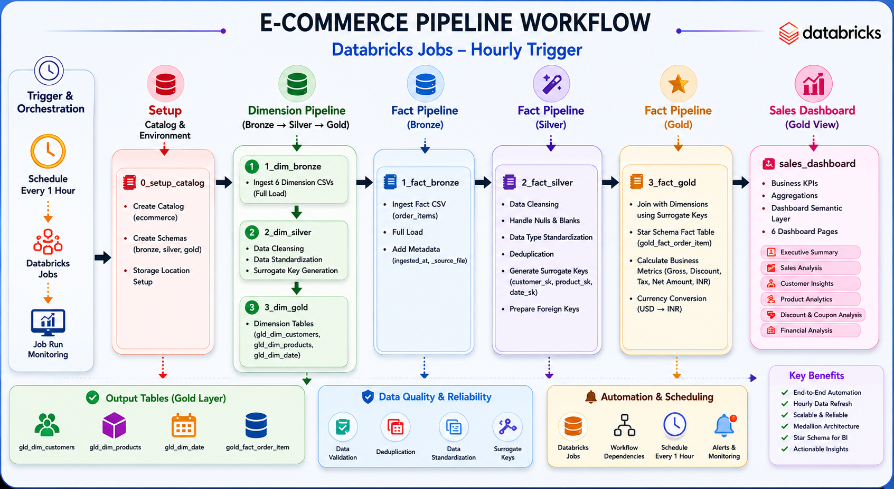

# Project Workflow

## Overview

The E-commerce BI Pipeline project was developed using Databricks Medallion Architecture to build a scalable and analytics-ready business intelligence solution.

The workflow automates the complete ETL lifecycle starting from raw CSV ingestion to Gold-layer analytical dashboards.

---

# Workfolw Pipeline

---

# Workflow Stages

## 1. Data Ingestion (Bronze Layer)

Raw datasets were ingested from landing storage into Delta Lake Bronze tables.

### Source Files
- Brands Dataset
- Category Dataset
- Customers Dataset
- Products Dataset
- Orders / Order Items Dataset
- Date Dataset

### Operations Performed
- Schema definition
- Raw data loading
- Metadata tracking
- File ingestion timestamp creation

### Output Tables
- bronze.brand
- bronze.category
- bronze.customers
- bronze.products
- bronze.order_items
- bronze.dates

---

## 2. Data Cleansing & Transformation (Silver Layer)

The Silver layer performs standardization, validation, and cleansing.

### Key Transformations
- Duplicate removal
- Null handling
- Data type conversion
- Currency normalization
- Coupon standardization
- Channel mapping
- Timestamp conversion
- Product normalization

### Example Operations
- Converted quantity values to integers
- Removed currency symbols from price fields
- Converted discount percentages to numeric values
- Standardized product material names
- Generated surrogate keys

### Output Tables
- silver.brand
- silver.category
- silver.customers
- silver.products
- silver.order_items
- silver.dates

---

## 3. Business-Ready Analytics Layer (Gold Layer)

The Gold layer transforms cleaned data into analytical models optimized for dashboarding and reporting.

### Gold Dimensions
- gld_dim_products
- gld_dim_customers
- gld_dim_date

### Gold Fact Table
- gold_fact_order_item

### Dashboard Model
- sales_dashboard

### Business Metrics Generated
- Gross Sales
- Net Sales
- Discount Amount
- Tax Amount
- Average Order Value
- Customer Metrics
- Product Metrics
- Financial KPIs

---

# Workflow Orchestration

Databricks Jobs & Pipelines were used to automate ETL execution.

## Pipeline Flow

Bronze → Silver → Gold

### Workflow Features
- Task dependency management
- Scheduled execution
- Automated orchestration
- Delta Lake optimization
- Pipeline monitoring

### Trigger Configuration
- Scheduled Trigger: Every 5 Days
- Workflow Type: Serverless Databricks Job

---

# Dashboard Development

An interactive Databricks SQL Dashboard was developed for business analytics.

## Dashboard Pages
1. Executive Summary
2. Sales Analysis
3. Customer Insights
4. Product Analytics
5. Discount & Coupon Analysis
6. Financial Analysis

---

# Technologies Used

| Technology | Purpose |
|---|---|
| Databricks | Data Engineering Platform |
| PySpark | Data Processing |
| Delta Lake | Storage Layer |
| Databricks SQL | Analytics |
| SQL | Querying |
| GitHub | Version Control |
| Dashboarding | BI Visualization |

---

# End-to-End Pipeline

Raw CSV Files  
↓  
Bronze Layer (Raw Storage)  
↓  
Silver Layer (Cleansed Data)  
↓  
Gold Layer (Analytics Ready)  
↓  
Databricks SQL Dashboard  
↓  
Business Insights
